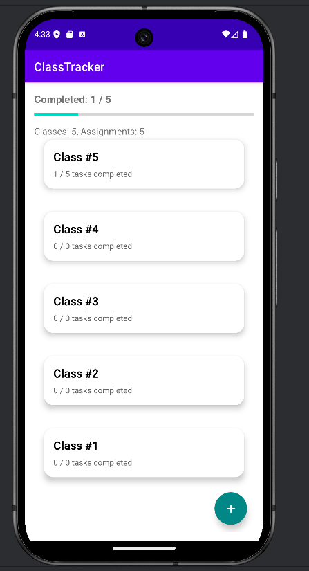
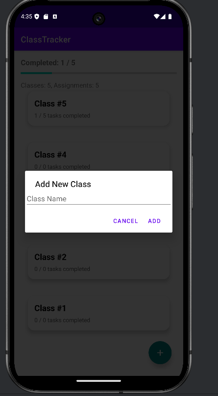
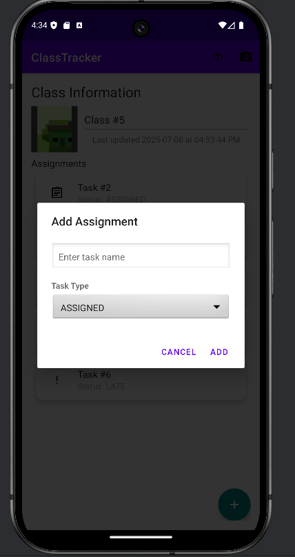

# 🎓 ClassTracker

An Android app to help students organize and manage their college classes and assignments, with features to track task completion and attach visual evidence.

---

## 📱 Demo

[](https://www.youtube.com/watch?v=DEMO_VIDEO_ID)

---

## 🚀 Features

- Add, update, and delete classes
- Assign tasks to each class with status: Assigned, Completed, Late, Optional
- Swipe to remove tasks
- Attach and view task-related photos
- Track class progress with progress bars
- Dark mode support

---

## 📸 Screenshots

| Home Screen |   Add Class   |   Add Task   |
|-------------|---------------|--------------|
|  |  |  |

---

## 🛠️ Technologies Used

- Kotlin
- Android Jetpack (ViewModel, LiveData, Room)
- RecyclerView
- Navigation Components
- Material Design
- ViewBinding
- Photo Capture (Camera + FileProvider)

---

## 🧪 Currently Working Features

- Persistent storage of classes and tasks using Room
- Task progress tracking with completion percentage
- Dialog-based task creation with dropdown for task type
- Inline image attachment per class
- Swipe-to-delete task interactions

---

## 🐞 Known Issues

- Photo capture may fail on some Android 11+ devices without storage permission
- No due date sorting yet
- Basic task validation only

---

## 📈 Future Enhancements

- Calendar integration
- Notifications for upcoming due dates
- Cloud sync or backup
- Filtering/sorting tasks
- Task categorization by type or priority

---

## 👥 Team & Contact

**Developer:** Siddharth Jain  
📧 Email: siddharthjain@vt.edu  
🔗 GitHub: [github.com/yourusername/ClassTracker](https://github.com/yourusername/ClassTracker)

---

## 💻 Getting Started

Clone the repo:
```bash
git clone https://github.com/yourusername/ClassTracker.git
