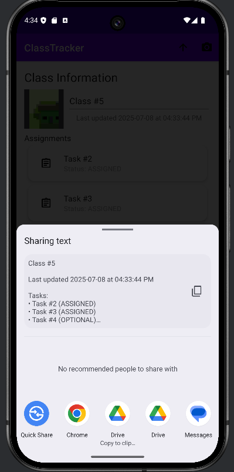

# 🎓 ClassTracker

TaskMate is a student productivity app built for Android that allows users to organize and manage their academic workload. Whether it's keeping track of assignments, marking tasks as complete, or adding helpful task notes and photos, TaskMate can help students stay on top of there work

---

## 📱 Demo

<p align="center">
  <video src="screenshots/DemoTest.mp4" width="500px"></video>
</p>

<video src="images/video.mp4" width="320" height="240" controls></video>


---

## 🚀 Features

- Add, update, and delete classes
- Assign tasks to each class with status: Assigned, Completed, Late, Optional
- Swipe to remove tasks
- Attach and view task-related photos
- Track class progress with progress bars

---

## 📸 Screenshots

| Home Screen |   Add Class   |   Add Task   |  Inside of Class |   Share Class      |
|-------------|---------------|--------------|-------------------|-------------------|
|  |  |  |  ||

---

## 🛠️ Technologies Used

- Kotlin
- Android Jetpack (ViewModel, LiveData, Room)
- RecyclerView
- Navigation Components
- Material Design
- ViewBinding
- Photo Capture (Camera + FileProvider)

---

## 🧪 Currently Working Features

- Persistent storage of classes and tasks using Room
- Task progress tracking with completion percentage
- Dialog-based task creation with dropdown for task type
- Inline image attachment per class
- Swipe-to-delete task interactions

---

## 🐞 Known Issues

- Tasks within class sometimes are unavalible till the class is refreshed or backed out of
- Progress Bar doesnt work if tasks are swiped only if changed to completed
- No due date sorting yet

---

## 📈 Future Enhancements

- Calendar integration
- Notifications for upcoming due dates
- Cloud sync or backup
- Filtering/sorting tasks
- Task categorization by type or priority

---

## 👥 Contact

**Developer:** Siddharth Jain  
📧 Email: siddharthjain@vt.edu  
🔗 GitHub: [github.com/yourusername/ClassTracker](https://github.com/Sid-Jain1/TaskMate)

---

## 💻 Getting Started

Clone the repo:
```bash
git clone https://github.com/yourusername/ClassTracker.git
